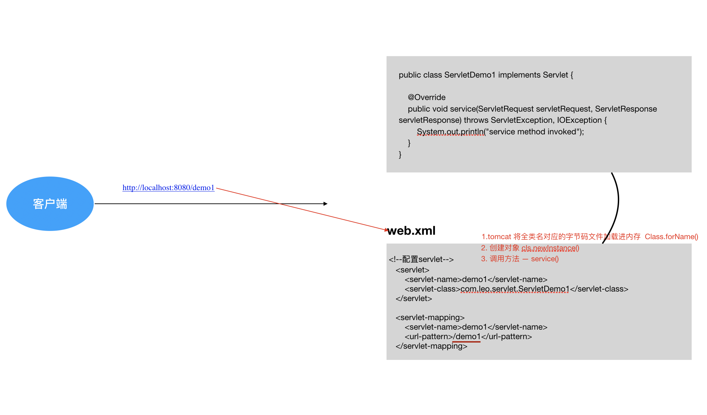
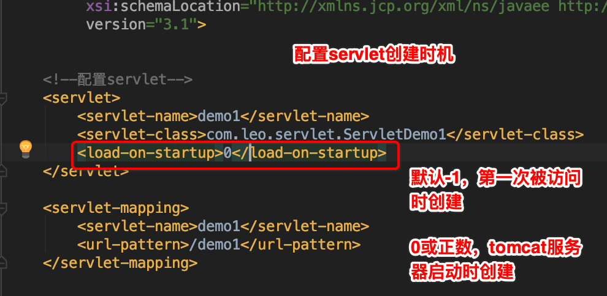

###Servlet： server applet

- 概念：运行在服务器端的小程序
  - Servlet就是一个接口，定义了Java类被浏览器访问到(tomcat识别)的规则。
  - 将来我们自定义一个类，实现Servlet接口，复写方法。

- 快速入门：

  1. 创建JavaEE项目
  2. 定义一个类，实现Servlet接口
     - public class ServletDemo1 implements Servlet

  3. 实现接口中的抽象方法

  4. 配置Servlet

     - 在web.xml中配置：

       ```
       <!--配置Servlet -->
       <servlet>
           <servlet-name>demo1</servlet-name>
           <servlet-class>cn.itcast.web.servlet.ServletDemo1</servlet-class>
       </servlet>
       
       <servlet-mapping>
           <servlet-name>demo1</servlet-name>
           <url-pattern>/demo1</url-pattern>
       </servlet-mapping>
       ```

       

- **执行原理：**

  1. 当服务器接受到客户端浏览器的请求后，会解析请求URL路径，获取访问的Servlet的资源路径

  2. 查找web.xml文件，是否有对应的<url-pattern>标签体内容

  3. 如果有，则在找到对应的<servlet-class>全类名

  4. tomcat会将字节码文件加载进内存，并且创建其对象

  5. 调用其方法

     

---

####Servlet中的生命周期方法：

- 被创建：执行init方法，只执行一次

  - Servlet什么时候被创建？

    - 默认情况下，第一次被访问时，Servlet被创建

    - 可以配置执行Servlet的创建时机。

      - 在<servlet>标签下配置

        - 第一次被访问时，创建
          - <load-on-startup>的值为负数
        -  在服务器启动时，创建
          - <load-on-startup>的值为0或正整数

        

> Servlet的init方法，只执行一次，说明一个Servlet在内存中只存在一个对象，Servlet是单例的

​			* Servlet的init方法，只执行一次，说明一个Servlet在内存中只存在一个对象，Servlet是单例的

> > 多个用户同时访问时，可能存在线程安全问题。

> > 解决：尽量不要在Servlet中定义成员变量。即使定义了成员变量，也不要对修改值


- 提供服务：执行service方法，执行多次
  - 每次访问Servlet时，Service方法都会被调用一次。

- 被销毁：执行destroy方法，只执行一次
  - Servlet被销毁时执行。服务器关闭时，Servlet被销毁
  - 只有服务器正常关闭时，才会执行destroy方法。
  - destroy方法在Servlet被销毁之前执行，一般用于释放资源

---

###Servlet3.0：

- 好处：
  -  支持注解配置。可以不需要web.xml了。

- 步骤：
  1. 创建JavaEE项目，选择Servlet的版本3.0以上，可以不创建web.xml
  2. 定义一个类，实现Servlet接口
  3. 复写方法
  4. 在类上使用@WebServlet注解，进行配置

​				* @WebServlet("资源路径")

​		

```
# WebServlet 注解

@Target({ElementType.TYPE})
@Retention(RetentionPolicy.RUNTIME)
@Documented
public @interface WebServlet {
    String name() default "";
    String[] value() default {};
    String[] urlPatterns() default {};
    int loadOnStartup() default -1;
    WebInitParam[] initParams() default {};
    boolean asyncSupported() default false;
    String smallIcon() default "";
    String largeIcon() default "";
    String description() default "";
    String displayName() default "";
}

```


---

###Servlet的体系结构	

​		Servlet -- 接口

​			|

​		GenericServlet -- 抽象类

​			|

​		HttpServlet -- 抽象类

- `GenericServlet`：将Servlet接口中其他的方法做了默认空实现，只将`service()`方法作为抽象
  - 将来定义`Servlet`类时，可以继承`GenericServlet`，实现`service()`方法即可

- `HttpServlet`：对`http`协议的一种封装，简化操作
  - 定义类继承HttpServlet
  - 复写doGet/doPost方法

​	

#####Servlet相关配置

- urlpartten:Servlet访问路径
  - 一个Servlet可以定义多个访问路径 ： `@WebServlet({"/d4","/dd4","/ddd4"})`

  - 路径定义规则：

    - /xxx：路径匹配
    -  /xxx/xxx:多层路径，目录结构
    - *.do：扩展名匹配

    


---

###IDEA与tomcat的相关配置

- **IDEA会为每一个tomcat部署的项目单独建立一份配置文件**
  - 查看控制台的log：Using CATALINA_BASE:  "C:\Users\fqy\.IntelliJIdea2018.1\system\tomcat\_itcast"

- **工作空间项目  和   tomcat部署的web项目**
  - tomcat真正访问的是“tomcat部署的web项目”，"tomcat部署的web项目"对应着"工作空间项目" 的web目录下的所有资源
  - WEB-INF目录下的资源不能被浏览器直接访问。

-  **断点调试：使用"小虫子"启动 dubug 启动**