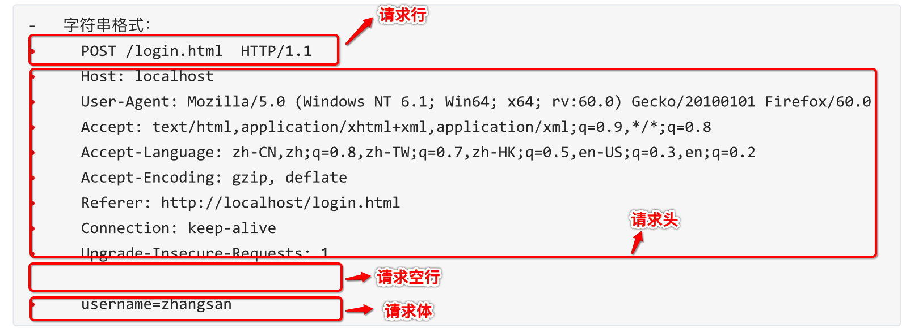
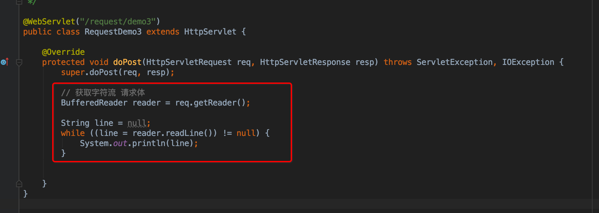
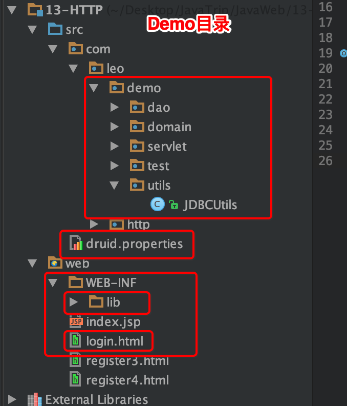
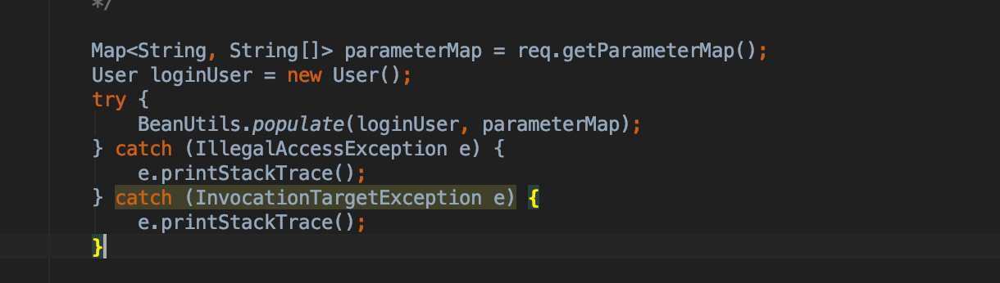
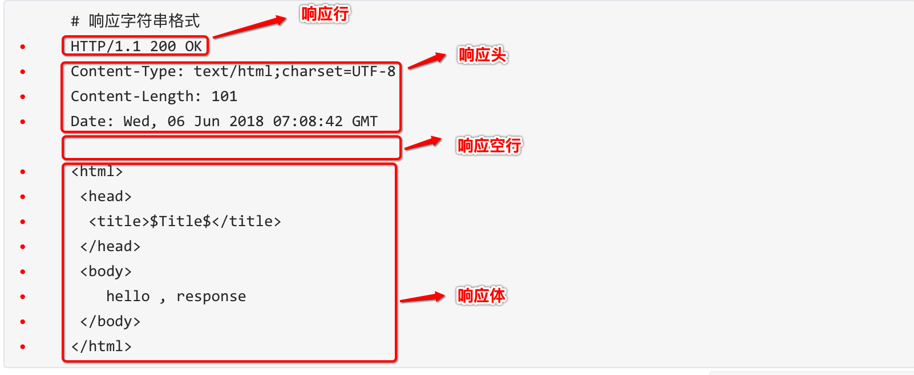
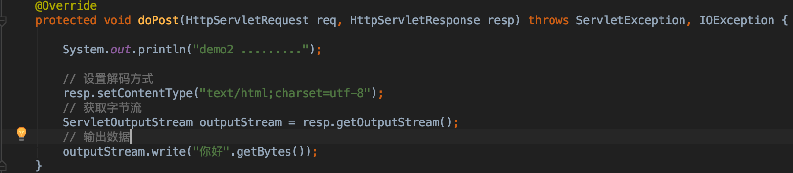

### HTTP：

- 概念：Hyper Text Transfer Protocol 超文本传输协议
  -  传输协议：定义了**客户端**和**服务器端**通信时，发送数据的格式
  -  特点：
    1. 基于TCP/IP的高级协议
    2. 默认端口号:80
    3. 基于请求/响应模型的:一次请求对应一次响应
    4. 无状态的：每次请求之间相互独立，不能交互数据

- 历史版本：
  - 1.0：每一次请求响应都会建立新的连接
  - 1.1：复用连接

---

### 请求消息数据格式

1. 请求行

   - 请求方式 请求url 请求协议/版本
     - `GET /login.html	HTTP/1.1`
     - HTTP协议有7中请求方式，常用的有2种
       - GET：
         1. 请求参数在请求行中，在url后。
         2. 请求的url长度有限制的
         3. 不太安全
       - POST：
         1. 请求参数在请求体中
         2. 请求的url长度没有限制的
         3. 相对安全

2. 请求头：客户端浏览器告诉服务器一些信息

   `请求头名称: 请求头值`

   - 常见的请求头：

     -  User-Agent：浏览器告诉服务器，我访问你使用的浏览器版本信息

       > 可以在服务器端获取该头的信息，解决浏览器的兼容性问题

     - Referer：http://localhost/login.html

       - 告诉服务器，我(当前请求)从哪里来？
         - 作用：
           - 防盗链：
           -  统计工作：

3. 请求空行

   - 空行，就是用于分割POST请求的请求头，和请求体的。

4. 请求体(正文)：

   - 封装POST请求消息的请求参数的

    


#### Request对象：

- `request`对象和`response`对象的原理
  - **`request`和`response`对象是由服务器创建的。我们来使用它们**
  - **`request`对象是来获取请求消息，`response`对象是来设置响应消息**

​	

- `request`对象继承体系结构：	

  ```
  		ServletRequest		--	接口
  ​			|	继承
  ​		HttpServletRequest	-- 接口
  ​			|	实现
  ​		org.apache.catalina.connector.RequestFacade 类(tomcat)
  ```

##### request功能：

- ***获取请求消息数据***

  - **获取请求行数据**

    - GET /day14/demo1?name=zhangsan HTTP/1.1

    - 方法：

      1. 获取请求方式 ：GET
         
    - `String getMethod()  `
         
      2. **获取虚拟目录：**/day14
       
      - `String getContextPath()`
       
      3. 获取Servlet路径: /demo1

         - `String getServletPath()`

      4. 获取get方式请求参数：name=zhangsan

         - `String getQueryString()`

      5. **获取请求URI：**/day14/demo1

         - `String getRequestURI() `	---->	/day14/demo1

         - `StringBuffer getRequestURL()`  ---->      http://localhost/day14/demo1
      
           > URL:统一资源定位符 ： http://localhost/day14/demo1	中华人民共和国
         >
           > URI：统一资源标识符 : /day14/demo1					共和国
      
      6. 获取协议及版本：HTTP/1.1
         
         - `String getProtocol()`
      7. 获取客户机的IP地址：
         
         - `String getRemoteAddr()`

  - **获取请求头数据**

    - 方法：
      -  **`String getHeader(String name) ` :  通过请求头的名称获取请求头的值**
      - Enumeration<String> getHeaderNames() :  获取所有的请求头名称

  - **获取请求体数据:**

    - 请求体：只有POST请求方式，才有请求体，在请求体中封装了POST请求的请求参数

    - 步骤：

      1. 获取流对象

         - `BufferedReader getReader()`：获取字符输入流，只能操作字符数据

           

         - `ServletInputStream getInputStream()`：获取字节输入流，可以操作所有类型数据

      2. 再从流对象中拿数据

- ***其他功能：***

  - **获取请求参数通用方式**：不论get还是post请求方式都可以使用下列方法来获取请求参数
    - `String getParameter(String name):`根据参数名称获取参数值  username=zs&password=123
    - `String[] getParameterValues(String name):`根据参数名称获取参数值的数组 hobby=xx&hobby=game
    - `Enumeration<String> getParameterNames():`获取所有请求的参数名称
    - ` Map<String,String[]> getParameterMap():`获取所有参数的map集合

  > 中文乱码问题：
  >
  > - get方式：tomcat 8 已经将get方式乱码问题解决了
  > - post方式：会乱码
  >   - 解决：在获取参数前，设置request的编码`request.setCharacterEncoding("utf-8");`

  

  - **请求转发：**一种在服务器内部的资源跳转方式
    - 步骤：
      1. 通过request对象获取请求转发器对象：`RequestDispatcher getRequestDispatcher(String path)`
      2. 使用RequestDispatcher对象来进行转发：`forward(ServletRequest request, ServletResponse response) `
    - 特点：
      1. 浏览器地址栏路径不发生变化
      2. 只能转发到当前服务器内部资源中。
      3. 转发是一次请求
  - **共享数据：**
    - 域对象：一个有作用范围的对象，可以在范围内共享数据
    - request域：代表***一次请求的范围***，一般用于请求转发的多个资源中共享数据
    - 方法：
      - `void setAttribute(String name,Object obj)` :  存储数据
      - `Object getAttitude(String name)` :   通过键获取值
      - `void removeAttribute(String name)`: 通过键移除键值对
  - **获取ServletContext：**
    - `ServletContext getServletContext()`

​			

---

##### 案例：用户登录

- 用户登录案例需求：

  1. 编写login.html登录页面 username & password 两个输入框

  2. 使用Druid数据库连接池技术,操作mysql，day14数据库中user表

  3. 使用JdbcTemplate技术封装JDBC

  4. 登录成功跳转到SuccessServlet展示：登录成功！用户名,欢迎您

  5. 登录失败跳转到FailServlet展示：登录失败，用户名或密码错误

     

- 开发步骤

  1. 创建项目，导入html页面，配置文件，jar包

     

  2. 创建数据库环境

     ```
     CREATE TABLE user(
     	id INT PRIMARY KEY auto_increment,
     	username VARCHAR(32) UNIQUE NOT NULL,
     	password VARCHAR(32) NOT NULL
     );
     ```

  3. 创建包cn.leo.domain,创建类User

     ```
     /**
      * 用户实体类
      */
     public class User {
         private int id;
         private String username;
         private String password;
     
         public int getId() {
             return id;
         }
         public void setId(int id) {
             this.id = id;
         }
         public String getUsername() {
             return username;
         }
         public void setUsername(String username) {
             this.username = username;
         }
         public String getPassword() {
             return password;
         }
         public void setPassword(String password) {
             this.password = password;
         }
         @Override
         public String toString() {
             return "User{" +
                     "id=" + id +
                     ", username='" + username + '\'' +
                     ", password='" + password + '\'' +
                     '}';
         }
     }
     ```

     

  4. 创建包cn.leo.util,编写工具类JDBCUtils

     ```
     
     /**
      * JDBC工具类
      */
     public class JDBCUtils {
         private static DataSource ds;
         static {
             try {
                 Properties properties = new Properties();
                 InputStream inputStream = JDBCUtils.class.getClassLoader().getResourceAsStream("druid.properties");
                 properties.load(inputStream);
                 ds = DruidDataSourceFactory.createDataSource(properties);
             } catch (IOException e) {
                 e.printStackTrace();
             } catch (Exception e) {
                 e.printStackTrace();
             }
         }
         /**
          * 获取连接池对象
          */
          
         public static DataSource getDataSource() {
             return ds;
         }
         
         /**
          * 获取Connection连接对象
          */
         public static Connection getConnection() throws SQLException {
             return ds.getConnection();
         }
     
         /**
          * 释放资源
          * @param stmt
          * @param conn
          */
         public static void close(Statement stmt, Connection conn) {
             close(null, stmt, conn);
         }
     
         public static void close(ResultSet rs, Statement stmt, Connection conn) {
             if (rs != null) {
                 try {
                     rs.close();
                 } catch (SQLException e) {
                     e.printStackTrace();
                 }
             }
             if (stmt != null) {
                 try {
                     stmt.close();
                 } catch (SQLException e) {
                     e.printStackTrace();
                 }
             }
             if (conn != null) {
                 try {
                     conn.close();
                 } catch (SQLException e) {
                     e.printStackTrace();
                 }
             }
         }
     }
     
     ```

     

  5. 创建包cn.leo.dao,创建类UserDao,提供login方法

     ```
     public class UserDao {
         private JdbcTemplate template = new JdbcTemplate(JDBCUtils.getDataSource());
         /**
          *
          * @param loginUser 只有用户名、密码
          * @return 返回用户所有信息
          */
         public User login(User loginUser) {
             try {
                 String sql = "select * from user where username = ? and password = ?";
                 User user = template.queryForObject(sql,
                         new BeanPropertyRowMapper<User>(User.class),
                         loginUser.getUsername(), loginUser.getPassword());
                 return user;
             } catch (Exception e) {
     //            e.printStackTrace();
                 return null;
             }
         }
     }
     ```

     

  6. 编写cn.leo.servlet.LoginServlet类

     ```
     @WebServlet("/login")
     public class LoginServlet extends HttpServlet {
     
         @Override
         protected void doPost(HttpServletRequest req, HttpServletResponse resp) throws ServletException, IOException {
     
             req.setCharacterEncoding("utf-8");
     
             String username = req.getParameter("username");
             String password = req.getParameter("password");
     
             User loginUser = new User();
             loginUser.setUsername(username);
             loginUser.setPassword(password);
     
             UserDao userDao = new UserDao();
             User user = userDao.login(loginUser);
     
             if (user != null) {
                 System.out.println("登陆成功");
                 req.setAttribute("user", user);
                 req.getRequestDispatcher("/success").forward(req, resp);
             } else {
                 System.out.println("登陆失败");
                 req.getRequestDispatcher("/fail").forward(req, resp);
             }
         }
     }
     ```

     

  7. 编写FailServlet和SuccessServlet类

     ```
     @WebServlet("/success")
     public class SuccessServlet extends HttpServlet {
     
         @Override
         protected void doPost(HttpServletRequest req, HttpServletResponse resp) throws ServletException, IOException {
             User user = (User) req.getAttribute("user");
             if (user != null) {
                 resp.setContentType("text/html;charset=utf-8");
                 resp.getWriter().write("登陆成功，" + user.getUsername() + " 欢迎你！");
             }
         }
     }
     
     
     @WebServlet("/fail")
     public class FailServlet extends HttpServlet {
     
         @Override
         protected void doPost(HttpServletRequest req, HttpServletResponse resp) throws ServletException, IOException {
             resp.setContentType("text/html;charset=utf-8");
             resp.getWriter().write("登陆失败，用户名或密码失败");
         }
     }
     ```

     

  8. login.html中form表单的action路径的写法

     - 虚拟目录+Servlet的资源路径

  9. BeanUtils工具类，简化数据封装

     

     - 用于封装JavaBean的
       - JavaBean：标准的Java类
         - 要求：
           - 类必须被public修饰
           -  必须提供空参的构造器
           - 成员变量必须使用private修饰
           - 提供公共setter和getter方法
         - 功能：封装数据
     - 概念：
       - 成员变量：`private String username;`
       - 属性：setter和getter方法截取后的产物
         - 例如：getUsername() --> Username--> username
     - 方法：
       - `setProperty()`
       - `getProperty()`
       - `populate(Object obj , Map map)`: 将map集合的键值对信息，封装到对应的JavaBean对象中

---

### 消息响应消息数据格式

- 响应消息：服务器端发送给客户端的数据

  -  数据格式：

    1. **响应行**

       1. 组成：协议/版本 响应状态码 状态码描述

       2. 响应状态码：服务器告诉客户端浏览器本次请求和响应的一个状态。

          1.  状态码都是3位数字 

          2. 分类：

             - 1xx：服务器就收客户端消息，但没有接受完成，等待一段时间后，发送1xx多状态码

             - 2xx：成功。代表：200

             - 3xx：重定向。代表：302(重定向)，304(访问缓存)

             - 4xx：客户端错误。
               - 代表：
                 - 404（请求路径没有对应的资源） 
                 - 405：请求方式没有对应的doXxx方法

             - 5xx：服务器端错误。代表：500(服务器内部出现异常)

    2. **响应头：**

       1. 格式：头名称： 值
       2. 常见的响应头：
          1. `Content-Type`：服务器告诉客户端本次响应体数据格式以及编码格式
          2. `Content-disposition`：服务器告诉客户端以什么格式打开响应体数据
             1. `in-line`:默认值,在当前页面内打开
             2. `attachment;filename=xxx`：以附件形式打开响应体。文件下载

    3. **响应空行**

    4. **响应体**: 传输的数据



---


#### Response 对象

- 功能：设置响应消息

  - **设置响应行**

    - 格式： HTTP/1.1 200 OK
    - 设置状态码：`setStatus(int sc)`

  - **设置响应头**

    - `setHeader(String name, String value)`

  - **设置响应体**

    - 获取输出流
      - 字符输出流：`PrintWriter getWriter()`
      - 字节输出流：`ServletOutputStream getOutputStream()`

    - 使用输出流，将数据输出到客户端浏览器

##### 案例

- 完成重定向

  - 资源跳转的方式

    ```
    /*
    // 设置响应行 重定向状态码 302
    resp.setStatus(302);
    // 设置响应头 location
    resp.setHeader("location", "/http-response/demo2");
    */
    
    // 简单实现
    //resp.sendRedirect("/http-response/demo2");
    
    // 动态获取虚拟目录
    String contextPath = req.getContextPath();
    resp.sendRedirect(contextPath + "/demo2");
    ```

  -  **重定向与转发的特点**

    - 重定向(redirect)

      ```
      1. 地址栏发生变化
      2. 重定向可以访问其他站点(服务器)的资源
      3. 重定向是两次请求。不能使用request对象来共享数据
      ```

    - 转发(forward)

      ```
      1. 转发地址栏路径不变
      2. 转发只能访问当前服务器下的资源
      3. 转发是一次请求，可以使用request对象来共享数据
      ```

    - **路径写法**

      - 相对路径：通过相对路径不可以确定唯一资源

        - 如：`./index.html`
        - 不以`/`开头，以`.`开头路径
        - 规则：**找到当前资源和目标资源之间的相对位置关系**
          - `./`：当前目录
          - `../`：后退一级目录

      - 绝对路径：通过绝对路径可以确定唯一资源

        - 如：`http://localhost/http-response/responseDemo2`		`/http-response/demo2`
        - 以`/`开头的路径

        - 规则：**判断定义的路径是给谁用的？判断请求将来从哪儿发出**
          - 给客户端浏览器使用：**需要加虚拟目录(项目的访问路径)**
            - 建议虚拟目录 动态获取：`request.getContextPath()`
            - <a> , <form> 重定向...
          - 给服务器使用：**不需要加虚拟目录**
            - 如：请求转发路径

- 服务器输出字符数据到浏览器

  - 步骤：

    - 获取字符输出流

      - `PrintWriter pw = response.getWriter();`获取的流的默认编码是`ISO-8859-1`

    - 输出数据

      > 乱码问题：
      >
      > 1. 设置该流的默认编码
      >
      > 2. 告诉浏览器响应体使用的编码
      >
      >    //简单的形式，设置编码，是在获取流之前设置
      >
      >    `response.setContentType("text/html;charset=utf-8");`

- 服务器输出字节数据到浏览器

  - 步骤：
    - 获取字节输出流
    - 输出数据

  

- 验证码

  ```
  @WebServlet("/checkCode")
  public class CheckCodeServlet extends HttpServlet {
      @Override
      protected void doPost(HttpServletRequest req, HttpServletResponse resp) throws ServletException, IOException {
  
          int width = 100;
          int height = 44;
          // 1. 创建一个对象，在内存中的图片（验证码图片对象）
          BufferedImage image = new BufferedImage(width, height, BufferedImage.TYPE_INT_BGR);
  
          // 2. 美化图片
          // 2.1 填充背景色
          Graphics g = image.getGraphics(); // 画笔对象
          g.setColor(Color.pink);
          g.fillRect(0, 0, width, height);
  
          // 2.2 画边框
          g.setColor(Color.BLUE);
          g.drawRect(0, 0, width - 1, height - 1);
  
          // 2.3 随机写文字
          String str = "ABCDEFGHIGKLMNOPQRSTUVWXYZabcdefghigklmnopqrstuvwxyz0123456789";
          Random random = new Random();
  
          g.setColor(Color.white);
  
          for (int i = 1; i <= 4; i++) {
              int index = random.nextInt(str.length());
              char ch = str.charAt(index);
              g.drawString(ch + "", width/5*i - 5, height/2);
          }
          // 2.4 画干扰线
          for (int i = 0; i < 6; i++) {
              int x1 = random.nextInt(width - 10) + 5;
              int x2 = random.nextInt(width - 10) + 5;
              int y1 = random.nextInt(height - 10) + 5;
              int y2 = random.nextInt(height - 10) + 5;
              g.drawLine(x1, y1, x2, y2);
          }
          // 3. 将图片输出到页面展示
          ImageIO.write(image, "jpg", resp.getOutputStream());
      }
  
      @Override
      protected void doGet(HttpServletRequest req, HttpServletResponse resp) throws ServletException, IOException {
          this.doPost(req, resp);
      }
  }
  ```

  ```
  ### 获取验证码
  <!DOCTYPE html>
  <html lang="en">
  <head>
      <meta charset="UTF-8">
      <title>Title</title>
  </head>
  <body>
      
      <a id="change" href="#">看不清换一张</a>
  </body>
  
  <script>
      window.onload = function() {
          var img = document.getElementById("checkCode");
          img.onclick = function () {
              var date = new Date().getTime();
              img.src = "/http-response/checkCode?" + date;
          }
      }
  </script>
  
  </html>
  ```

---

### ServletContext对象：

- 概念：**代表整个web应用，可以和程序的容器(服务器)来通信
- 获取：
  - 通过request对象获取
    - `request.getServletContext();`
  - 通过HttpServlet获取
    - `this.getServletContext();`

- 功能：

  - 获取`MIME`类型：

    - `MIME`类型:在互联网通信过程中定义的一种文件数据类型

      - 格式： 大类型/小类型  `text/html`		`image/jpeg`

      - 获取：`String getMimeType(String file)`

  - 域对象：共享数据

    - `setAttribute(String name,Object value)`

    - `getAttribute(String name)`

    - `removeAttribute(String name)`

      > **ServletContext对象范围：所有用户所有请求的数据**

  - 获取文件的真实(服务器)路径

    - 方法：`String getRealPath(String path)  `

      ```
      String b = context.getRealPath("/b.txt");//web目录下资源访问
      System.out.println(b);
      
      String c = context.getRealPath("/WEB-INF/c.txt");//WEB-INF目录下的资源访问
      System.out.println(c);
      
      String a = context.getRealPath("/WEB-INF/classes/a.txt");//src目录下的资源访问
      System.out.println(a);
      ```

      

---

#### 案例：

- 文件下载需求：
  1. 页面显示超链接
  2. 点击超链接后弹出下载提示框
  3. 完成图片文件下载

- 分析：
  1. 超链接指向的资源如果能够被浏览器解析，则在浏览器中展示，如果不能解析，则弹出下载提示框。不满足需求
  2. 任何资源都必须弹出下载提示框
  3. 使用响应头设置资源的打开方式：
     - `content-disposition:attachment;filename=xxx`

- 步骤：

  1. 定义页面，编辑超链接href属性，指向Servlet，传递资源名称filename

     ```
     <!DOCTYPE html>
     <html lang="en">
     <head>
         <meta charset="UTF-8">
         <title>下载页面</title>
     </head>
     <body>
         <a href="/http-response/res/tiger.jpg">图片1</a>
         <hr>
         <a href="/http-response/downloadServlet?filename=tiger.jpg">图片2</a>
     </body>
     </html>
     ```

     

  2. 定义Servlet

     1. 获取文件名称
     2. 使用字节输入流加载文件进内存
     3. 指定response的响应头： `content-disposition:attachment;filename=xxx`
     4. 将数据写出到response输出流

  ```
  @WebServlet("/downloadServlet")
  public class DownloadServlet extends HttpServlet {
  
      @Override
      protected void doPost(HttpServletRequest req, HttpServletResponse resp) throws ServletException, IOException {
  
          // 1.获取参数
          String filename = req.getParameter("filename");
          // 2.使用字节输入流加载文件到内存中
          // 2.1 获取文件路径
          ServletContext servletContext = this.getServletContext();
          String path = servletContext.getRealPath("/res/" + filename);
          // 2.2 创建字节输入流
          FileInputStream fis = new FileInputStream(path);
  
          // 3.设置response响应头
          String mimeType = servletContext.getMimeType(path);
          // 3.1 设置响应头类型  content-type
          resp.setHeader("content-type", mimeType);
          
           // 解决中文文件名编码问题
          String agent = req.getHeader("user-agent");
          filename = DownLoadUtils.getFileName(agent, filename);
          
          // 3.2 设置响应头打开方式  content-disposition
          resp.setHeader("content-disposition", "attachment;filename=" + filename);
  
          // 4.将输入流写入到输出流中
          ServletOutputStream sos = resp.getOutputStream();
  
          byte[] bytes = new byte[1024 * 10];
          int len = 0;
          while ((len = fis.read(bytes)) != -1) {
              sos.write(bytes, 0, len);
          }
  
          fis.close();
      }
  
      @Override
      protected void doGet(HttpServletRequest req, HttpServletResponse resp) throws ServletException, IOException {
          this.doPost(req, resp);
      }
  }
  ```

  

- 问题：
  - 中文文件问题
    - 解决思路：
      - 获取客户端使用的浏览器版本信息
      - 根据不同的版本信息，设置`filename`的编码方式不同