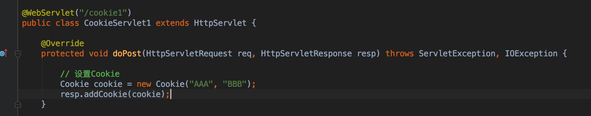
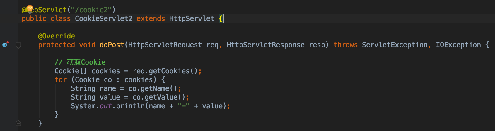

## 会话技术

- 会话：一次会话中包含多次请求和响应。
  - 一次会话：浏览器第一次给服务器资源发送请求，会话建立，直到有一方断开为止

- 功能：在一次会话的范围内的多次请求间，共享数据

- 方式：
  - 客户端会话技术：Cookie
  - 服务器端会话技术：Session

---

### Cookie：

- **概念**：**客户端会话技术，将数据保存到客户端**

- **使用步骤**

  1. 创建Cookie对象，绑定数据
     - `new Cookie(String name, String value) `
  2. 发送Cookie对象
     - `response.addCookie(Cookie cookie) `
  3. 获取Cookie，拿到数据
     - `Cookie[] request.getCookies()  `

  

  

  

- **实现原理**
  
- 基于响应头set-cookie和请求头cookie实现
  
- **cookie的细节**

  1. 一次可不可以发送多个cookie?

     - 可以
     - 可以创建多个Cookie对象，使用response调用多次addCookie方法发送cookie即可。

  2. cookie在浏览器中保存多长时间？

     - 默认情况下，当浏览器关闭后，Cookie数据被销毁
     - 持久化存储：
       - `setMaxAge(int seconds)`
         - **正数**：将Cookie数据写到硬盘的文件中。持久化存储。并指定cookie存活时间，时间到后，cookie文件自动失效
         - **负数**：默认值
         - **零**：删除cookie信息

  3. cookie能不能存中文？

     - **在tomcat 8 之前** cookie中不能直接存储中文数据。

     - 需要将中文数据转码---一般采用URL编码(%E3)
     - **在tomcat 8 之后**，cookie支持中文数据。特殊字符还是不支持，**建议使用URL编码存储，URL解码解析**

  4. cookie共享问题？

     1. 假设在一个tomcat服务器中，部署了多个web项目，那么在这些web项目中cookie能不能共享？
        - 默认情况下cookie不能共享
        - `setPath(String path)`:设置cookie的获取范围。默认情况下，设置当前的虚拟目录
        - 如果要共享，则可以将path设置为`"/"`
     2. 不同的tomcat服务器间cookie共享问题？
        - `setDomain(String path)`:  如果设置一级域名相同，那么多个服务器之间cookie可以共享
        - `setDomain(".baidu.com")`, 那么`tieba.baidu.com`和`news.baidu.com`中cookie可以共享

- **Cookie的特点和作用**

  - 特点
    - cookie存储数据在客户端浏览器
    - 浏览器对于单个cookie 的大小有限制(4kb) 以及 对同一个域名下的总cookie数量也有限制(20个)

  - 作用：
    - cookie一般用于存出少量的不太敏感的数据
    - 在不登录的情况下，完成服务器对客户端的身份识别


- **案例：记住上一次访问时间**
  - 需求：

    1. 访问一个Servlet，如果是第一次访问，则提示：您好，欢迎您首次访问。
    2. 如果不是第一次访问，则提示：欢迎回来，您上次访问时间为:显示时间字符串

  - 分析：

    1. 可以采用Cookie来完成
    2. 在服务器中的Servlet判断是否有一个名为lastTime的cookie
       - **有**：不是第一次访问
         - 响应数据：欢迎回来，您上次访问时间为:2018年6月10日11:50:20
         - 写回Cookie：lastTime=2018年6月10日11:50:01
       - **没有**：是第一次访问
         - 响应数据：您好，欢迎您首次访问
         - 写回Cookie：lastTime=2018年6月10日11:50:01

  - 代码实现：

    ```
    
    @WebServlet("/cookieDemo")
    public class CookieDemo extends HttpServlet {
    
        @Override
        protected void doPost(HttpServletRequest req, HttpServletResponse resp) throws ServletException, IOException {
    				// 设置响应数据格式
            resp.setContentType("text/html;charset=utf-8");
    
            Cookie[] cookies = req.getCookies();
    				// 获取此处访问时间
            Date date = new Date();
            SimpleDateFormat format = new SimpleDateFormat("yyyy年MM月dd日 HH:mm:ss");
            String dateStr = format.format(date);
            // URL编码解决Cookie存储空格的问题
            dateStr = URLEncoder.encode(dateStr, "utf-8");
    
            // 是否访问过标识
            boolean flag = false;
    
            if (cookies != null && cookies.length > 0) {
    
                for (Cookie c: cookies) {
    
                    if ("lastTime".equals(c.getName())) {
    
                        // URL解码
                        String lastDateStr = URLDecoder.decode(c.getValue(), "utf-8");
    
                        // 更新Cookie
                        c.setMaxAge(30);
                        c.setValue(dateStr);
                        resp.addCookie(c);
    
                        resp.getWriter().write("欢迎回来，您上次访问时间为:" + lastDateStr);
                        flag = true;
                        break;
                    }
                }
            }
    
            if (cookies == null || cookies.length == 0 || flag == false) {
                resp.getWriter().write("您好，欢迎您首次访问。");
    
                Cookie cookie = new Cookie("lastTime", dateStr);
                cookie.setMaxAge(30);
                resp.addCookie(cookie);
            }
        }
    
        @Override
        protected void doGet(HttpServletRequest req, HttpServletResponse resp) throws ServletException, IOException {
            this.doPost(req, resp);
        }
    }
    
    ```


### JSP：入门学习

- 概念：**Java Server Pages**： java服务器端页面
  -  可以理解为：**一个特殊的页面，其中既可以指定定义html标签，又可以定义java代码**
  - 用于简化书写！！！

- **原理**: JSP本质上就是一个Servlet

- **JSP的脚本**：JSP定义Java代码的方式
  1. `<% 代码 %>`：定义的java代码，在service方法中。service方法中可以定义什么，该脚本中就可以定义什么。
  2. `<%! 代码 %>`：定义的java代码，在jsp转换后的java类的成员位置。
  3. `<%= 代码 %>`：定义的java代码，会输出到页面上。输出语句中可以定义什么，该脚本中就可以定义什么。

- JSP的内置对象：

  -  在jsp页面中不需要获取和创建，可以直接使用的对象

  - jsp一共有9个内置对象。

    - request

    - response

    - out：字符输出流对象。可以将数据输出到页面上。和response.getWriter()类似

      > response.getWriter()和out.write()的区别：
      >
      > - 在tomcat服务器真正给客户端做出响应之前，会先找response缓冲区数据，再找out缓冲区数据。
      > - response.getWriter()数据输出永远在out.write()之前


### Session：主菜

- **概念：**服务器端会话技术，在一次会话的多次请求间共享数据，将数据保存在服务器端的对象中。HttpSession

- **快速入门：**
  1. 获取HttpSession对象：
     - HttpSession session = request.getSession();
  2. 使用HttpSession对象：
     - `Object getAttribute(String name)  `
     - `void setAttribute(String name, Object value)`
     - `void removeAttribute(String name)  `

- **原理**

  Session的实现是依赖于Cookie的。

- **细节：**
  - 当客户端关闭后，服务器不关闭，两次获取session是否为同一个？

    - 默认情况下。不是。

    - 如果需要相同，则可以创建Cookie,键为JSESSIONID，设置最大存活时间，让cookie持久化保存。

      ```
      Cookie c = new Cookie("JSESSIONID",session.getId());
      c.setMaxAge(60*60);
      response.addCookie(c);
      ```

  - 客户端不关闭，服务器关闭后，两次获取的session是同一个吗？

    - 不是同一个，但是要确保数据不丢失。tomcat自动完成以下工作

      - **session的钝化：**
        - 在服务器正常关闭之前，将session对象系列化到硬盘上
      - **session的活化：**
        - 在服务器启动后，将session文件转化为内存中的session对象即可。	

      > **IDEA中内嵌的tomcat会钝化，但是活化会失败**

  - session什么时候被销毁？

    - 服务器关闭

    - session对象调用invalidate() 。

    - session默认失效时间 30分钟

      - 选择性配置修改	

        ```
        <session-config>
        <session-timeout>30</session-timeout>
        </session-config>
        ```

  - session的特点

    - session用于存储一次会话的多次请求的数据，存在服务器端
    - session可以存储任意类型，任意大小的数据


> **session与Cookie的区别：**
>
> - session存储数据在服务器端，Cookie在客户端
> - session没有数据大小限制，Cookie有
> - session数据安全，Cookie相对于不安全


### 案例：验证码

- 案例需求：

  - 访问带有验证码的登录页面login.jsp
  - 用户输入用户名，密码以及验证码。
    - 如果用户名和密码输入有误，跳转登录页面，提示:用户名或密码错误
    - 如果验证码输入有误，跳转登录页面，提示：验证码错误
    - 如果全部输入正确，则跳转到主页success.jsp，显示：用户名,欢迎您

  ```
  @WebServlet("/login")
  public class LoginDemo extends HttpServlet {
  
      @Override
      protected void doPost(HttpServletRequest req, HttpServletResponse resp) throws ServletException, IOException {
          req.setCharacterEncoding("utf-8");
  
          String username = req.getParameter("username");
          String password = req.getParameter("password");
          String checkCode = req.getParameter("checkCode");
  
          // 获取Session中的验证码
          HttpSession session = req.getSession();
          String checkCode_session = (String) session.getAttribute("checkCode_session");
          // 移除Session中的验证码
          session.removeAttribute("checkCode_session");
  
          if (checkCode_session != null && checkCode_session.equalsIgnoreCase(checkCode)) { // 验证码一致
              if ("Tom".equals(username) && "1234".equals(password)) {
                  req.getSession().setAttribute("user", username);
                  resp.sendRedirect(req.getContextPath() + "/success.jsp");
              } else {
                  req.setAttribute("user_error", "用户名或密码错误");
                  req.getRequestDispatcher("/login.jsp").forward(req, resp);
              }
  
          } else {
              req.setAttribute("cc_error", "验证码错误");
              req.getRequestDispatcher("/login.jsp").forward(req, resp);
          }
          
      }
  
      @Override
      protected void doGet(HttpServletRequest req, HttpServletResponse resp) throws ServletException, IOException {
          this.doPost(req, resp);
      }
  }
  
  # CheckCodeServlet
  
  @WebServlet("/checkCode")
  public class CheckCodeServlet extends HttpServlet {
  
      @Override
      protected void doPost(HttpServletRequest req, HttpServletResponse resp) throws ServletException, IOException {
  
          int width = 100;
          int height = 44;
          // 1. 创建一个对象，在内存中的图片（验证码图片对象）
          BufferedImage image = new BufferedImage(width, height, BufferedImage.TYPE_INT_BGR);
  
          // 2. 美化图片
          // 2.1 填充背景色
          Graphics g = image.getGraphics(); // 画笔对象
          g.setColor(Color.pink);
          g.fillRect(0, 0, width, height);
  
          // 2.2 画边框
          g.setColor(Color.BLUE);
          g.drawRect(0, 0, width - 1, height - 1);
  
          // 2.3 随机写文字
          String str = "ABCDEFGHIGKLMNOPQRSTUVWXYZabcdefghigklmnopqrstuvwxyz0123456789";
          Random random = new Random();
  
          g.setColor(Color.white);
  
          StringBuilder sb = new StringBuilder();
          for (int i = 1; i <= 4; i++) {
              int index = random.nextInt(str.length());
              char ch = str.charAt(index);
              g.drawString(ch + "", width/5*i - 5, height/2);
  
              sb.append(ch);
          }
  
          // 存储自动生成验证码
          String checkCode_session = sb.toString();
          req.getSession().setAttribute("checkCode_session", checkCode_session);
  
          // 2.4 画干扰线
          for (int i = 0; i < 6; i++) {
              int x1 = random.nextInt(width - 10) + 5;
              int x2 = random.nextInt(width - 10) + 5;
  
              int y1 = random.nextInt(height - 10) + 5;
              int y2 = random.nextInt(height - 10) + 5;
              g.drawLine(x1, y1, x2, y2);
          }
  
          // 3. 将图片输出到页面展示
          ImageIO.write(image, "jpg", resp.getOutputStream());
      }
  
      @Override
      protected void doGet(HttpServletRequest req, HttpServletResponse resp) throws ServletException, IOException {
          this.doPost(req, resp);
      }
  }
  
  ```

  ```
  # success.jsp
  <%@ page contentType="text/html;charset=UTF-8" language="java" %>
  <html>
  <head>
      <title>登陆成功</title>
  </head>
  <body>
  
  <h1><%=request.getSession().getAttribute("user")%>,欢迎您</h1>
  </body>
  </html>
  
  # login.jsp
  <%@ page contentType="text/html;charset=UTF-8" language="java" %>
  <html>
  <head>
      <title>验证码登陆</title>
  
      <style>
  
          div {
              color: #f00;
          }
      </style>
  
  </head>
  <body>
  
  <form action="/cookie/login" method="post">
  
      <table>
          <tr>
              <td>用户名</td>
              <td><input type="text" placeholder="请输入用户名" name="username"></td>
          </tr>
          <tr>
              <td>密码</td>
              <td><input type="password" placeholder="请输入密码" name="password"></td>
          </tr>
          <tr>
              <td>验证码</td>
              <td><input type="text" placeholder="请输入验证码" name="checkCode"></td>
          </tr>
          <tr>
              <td colspan="2"></td>
          </tr>
          <tr>
              <td><input type="submit" value="提交"></td>
          </tr>
  
      </table>
  </form>
  
  <div><%=request.getAttribute("cc_error") == null ? "" : request.getAttribute("cc_error")%></div>
  <div><%=request.getAttribute("user_error") == null ? "" : request.getAttribute("user_error") %></div>
  </body>
  <script>
      window.onload = function () {
          var img = document.getElementById("img");
  
          img.onclick = function () {
              var time = new Date().getTime();
              this.src = "/cookie/checkCode?t=" + time;
          }
      }
  </script>
  
  </html>
  
  
  ```

  

  